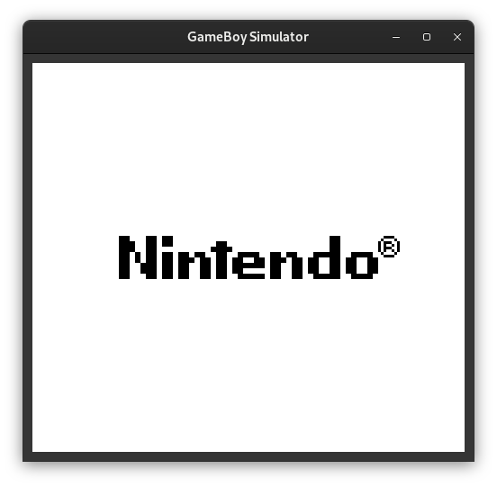

# Game boy emulator
A game boy emulator in C !

## Playing
CLI commands:  
```
cd src
export LD_LIBRARY_PATH=.
make
```

And then give as argument the name of the game, for example to play flappybird:  
`./gbsimulator ../data/flappyboy.gb`

Depending on the system some librairies may be required.
For Debian systems, uncomment `line 30` in `src/Makefile`:  
`LDLIBS += -lcheck -lm -lrt -pthread -lsubunit`  
and comment `line 31`.
